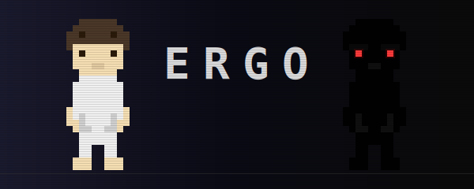
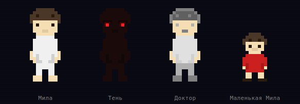

<p align="center">
  
</p>

<p align="center">
  
  
  
  
</p>

---

## О чём эта игра

**Мила** приходит в себя в пустой белой комнате. Она не помнит, как оказалась здесь. Единственная дверь ведёт в коридор с другими дверьми — каждая открывает фрагмент забытого прошлого.

> *«Ты выбрала быть здесь. Вспомни — почему.»*

ERGO — это путешествие по подсознанию девушки, находящейся в коме после попытки суицида. Исследуя искажённые воспоминания, игрок по частям восстанавливает историю Милы и в конечном счёте решает её судьбу.

---

## Персонажи

<p align="center">
  
</p>

| Персонаж | Описание |
|----------|----------|
| **Мила** | Главная героиня. Девушка в коме, путешествующая по собственному подсознанию |
| **Тень** | Тёмное отражение Милы. Преследует её сквозь воспоминания. Красные глаза в темноте |
| **Доктор** | Загадочный проводник без лица. Ждёт в коридоре между мирами |
| **Маленькая Мила** | Детская версия героини в красном платье. Рисует стрелки на стенах школы |

---

## Особенности

- **Ноль внешних ассетов** — вся графика и звук генерируются процедурно прямо в браузере
- **Пиксельный стиль** — внутреннее разрешение 256x192, тайлы 16x16
- **Процедурный саундтрек** — дроны, эмбиент и звуковые эффекты через Web Audio API
- **Нелинейный сюжет** — 3 концовки, определяемые выбором игрока
- **Система рассудка** — мир реагирует на состояние героини
- **Тень** — преследующий антагонист, отражение Милы

---

## Локации

| Локация | Описание |
|---------|----------|
| **Белая комната** | Начальная точка. Пустота, которая постепенно разрушается с каждым возвращением |
| **Коридор** | Хаб между мирами. Здесь ждёт Доктор — проводник без лица |
| **Квартира** | Затопленный дом детства. Фотографии на стенах и призрак ушедшей матери |
| **Школа** | Бесконечные коридоры с безликими тенями учеников |
| **Мёртвый сад** | Пепел вместо снега, безымянная могила в центре |
| **Больница** | Искажённая палата — кровать на потолке, капельница течёт вверх |
| **Пустота** | Финальная встреча с Тенью — тёмным отражением Милы |

---

## Запуск

```bash
# Клонировать репозиторий
git clone https://github.com/J4Day/Ergo.git

# Открыть в браузере
# Вариант 1: просто открыть index.html
# Вариант 2: через локальный сервер (рекомендуется для аудио)
cd Ergo
npx serve .
# или
python -m http.server 8000
```

> Рекомендуемый браузер: **Chrome / Edge** (лучшая поддержка Web Audio API)

---

## Управление

| Клавиша | Действие |
|---------|----------|
| `WASD` / Стрелки | Перемещение |
| `E` / `Enter` | Взаимодействие / Продолжить диалог |
| `Shift` | Бег |
| `Esc` | Пауза |

---

## Технологии

```
HTML5 Canvas     — рендеринг
Web Audio API    — процедурный звук
Vanilla JS       — без фреймворков, без зависимостей
Процедурная генерация — все спрайты, тайлсеты и звуки
```

---

<p align="center">
  <sub>Сделано без единого внешнего ассета. Каждый пиксель и каждый звук — процедурные.</sub>
</p>

<p align="center">
  <a href="https://github.com/J4Day/Ergo/issues"><b>Баги и предложения</b></a>
</p>
